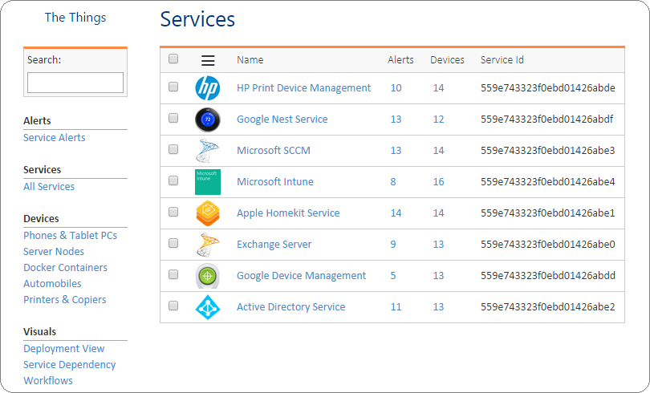

# node-things
A web application demonstrating the use of NodeJS and AngularJS frameworks.Animated list views and a good amount of CSS sprinkling is also used.

Technology stack:

* Node JS
* Mongo DB
* REST Services
* Angular JS
* CSS

It looks sometihng like this:
